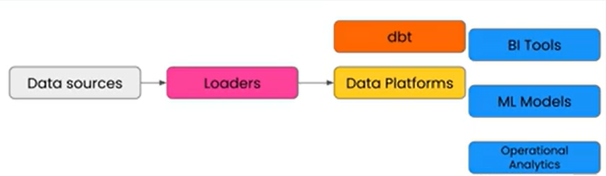

# dbt Fundamentals

Date: March 27, 2026
My first dbt project build with the help and guidance on [dbt Fundamentals (VS Code)](https://learn.getdbt.com/learn/course/dbt-fundamentals-vs-code)

# **1. dbt and Analytics Development Lifecycle**

## What is the dbt role?

It communicates directly to data platforms
Collect bunch of meta data, test data and make sure everything operate the way we expected to (blue block : typical downstream operational or analytics use)

and act as bridge between data sources and final data use



More illustration to understand what dbt is


## Why dbt?

- Write transformations in **SQL** (with Jinja templating on top)
- Models are just `SELECT` statements — dbt handles the DDL (`CREATE`, `INSERT`, etc.)
- Built-in **testing**, **documentation**, and **lineage graph**
- Version control friendly — every model is a `.sql` file in Git

## Key Philosophy

- **Modularity**: Break complex logic into small, reusable models
- **`ref()` function**: Models reference each other, not hardcoded table names → dbt auto-resolves dependencies
- **Single source of truth**: Business logic lives in one place, not scattered across BI tools

## **Analytics Development Lifecycle (ADLC)**


The role of dbt in ADLC

- Provides a structured process for building, testing, reviewing, and deploying analytics.
- Encourages iteration and collaboration so teams can confidently move from idea to production.
- Aligns data work with software engineering best practices—version control, testing, and continuous improvement.

## **dbt as the Data Control Plane**

- dbt orchestrates and governs the ADLC across your data ecosystem.
- It ensures consistency in how data is developed, tested, documented, and deployed.


Planes: data pipeline, pilots : developers, control tower : dbt,  destination : trusted insights
dbt coordinates how data is transformed, tested, and documented across systems


dbt coordinate 6 key activities 

## dbt Project Structure

```
my_project/
├── dbt_project.yml       ← project config (name, materialization, paths)
├── profiles.yml          ← connection config (warehouse credentials) — NOT committed to Git
├── models/
│   ├── staging/          ← stg_* models, 1:1 with source tables, light cleaning
│   ├── intermediate/     ← int_* models, joins and business logic
│   └── marts/            ← final models exposed to BI tools
├── macros/               ← reusable Jinja functions
├── tests/                ← singular tests (.sql files)
├── seeds/                ← static CSV data
└── snapshots/            ← SCD Type 2 logic
```

## Materializations

| Type | Behavior | When to Use |
| --- | --- | --- |
| `view` | Creates a SQL view (default) | Lightweight, frequently queried |
| `table` | Creates a full table (DROP + recreate) | Complex logic, slow views |
| `incremental` | Appends/merges only new rows | Large tables, append-only data |
| `ephemeral` | Exists only as a CTE in memory | Intermediate logic, not stored |

---

---

# 2. Setup

## 2a. Prerequisites

- Python installed
- pip / virtual environment
- Git + VS Code
- BigQuery project with credentials (service account JSON or OAuth)
- dbt VS Code extension

# Choose one Snowflake or Big Query

## 2b. Setting up Snowflake account (free trial)

1. Sign up snowflake account
2. Create database and schema 
Create sql files and paste this code snippets

**Snowflake Code snippets**

```sql
create warehouse transforming;

create database raw;

create database analytics;

create schema raw.jaffle_shop;

create schema raw.stripe;

_________________________________________________________________________

create table raw.jaffle_shop.customers
( id integer,
  first_name varchar,
  last_name varchar
);

_________________________________________________________________________

copy into raw.jaffle_shop.customers (id, first_name, last_name)
from 's3://dbt-tutorial-public/jaffle_shop_customers.csv'
file_format = (
    type = 'CSV'
    field_delimiter = ','
    skip_header = 1
    );

_________________________________________________________________________

create table raw.jaffle_shop.orders
( id integer,
  user_id integer,
  order_date date,
  status varchar,
  _etl_loaded_at timestamp default current_timestamp
);
_________________________________________________________________________

copy into raw.jaffle_shop.orders (id, user_id, order_date, status)
from 's3://dbt-tutorial-public/jaffle_shop_orders.csv'
file_format = (
    type = 'CSV'
    field_delimiter = ','
    skip_header = 1
    );

_________________________________________________________________________

create table raw.stripe.payment
( id integer,
  orderid integer,
  paymentmethod varchar,
  status varchar,
  amount integer,
  created date,
  _batched_at timestamp default current_timestamp
);
_________________________________________________________________________

copy into raw.stripe.payment (id, orderid, paymentmethod, status, amount, created)
from 's3://dbt-tutorial-public/stripe_payments.csv'
file_format = (
    type = 'CSV'
    field_delimiter = ','
    skip_header = 1
    );

_________________________________________________________________________

select * from raw.jaffle_shop.customers;

select * from raw.jaffle_shop.orders;

select * from raw.stripe.payment;
```

1. Open account details lower left to view the account name and configurations

[connections.my_example_connection]
account = "XXXXXXXXXXXXX"
user = "XXXXXXXXXXXX"
password = "XXXXXXXXXXXXXXXXXX"
role = "ACCOUNTADMIN"
warehouse = "TRANSFORMING"
database = "ANALYTICS"
schema = "DBT_BHIPPLE"


## 2c. Setting up BQ (free tier available, billing optional for learning)

1. Register account on BQ
2. Create new project (e.g. : Jaffle Shop)


1. SQL worksheet to create database and schema

```sql
-- =========================================
-- CREATE SCHEMAS (DATASETS)
-- =========================================

create schema if not exists `jaffle-shop.raw_jaffle_shop`;
create schema if not exists `jaffle-shop.raw_stripe`;
create schema if not exists `jaffle-shop.analytics`;

-- =========================================
-- CREATE TABLES
-- =========================================

create or replace table `jaffle-shop.raw_jaffle_shop.customers` (
  id int64,
  first_name string,
  last_name string
);

create or replace table `jaffle-shop.raw_jaffle_shop.orders` (
  id int64,
  user_id int64,
  order_date date,
  status string,
  _etl_loaded_at timestamp default current_timestamp()
);

create or replace table `jaffle-shop.raw_stripe.payment` (
  id int64,
  orderid int64,
  paymentmethod string,
  status string,
  amount int64,
  created date,
  _batched_at timestamp default current_timestamp()
);

-- =========================================
-- CREATE EXTERNAL TABLES (untuk load)
-- =========================================

create or replace external table `jaffle-shop.raw_jaffle_shop.customers_ext`
options (
  format = 'CSV',
  uris = ['gs://dbt-tutorial-public/jaffle_shop_customers.csv'],
  skip_leading_rows = 1
);

create or replace external table `jaffle-shop.raw_jaffle_shop.orders_ext`
options (
  format = 'CSV',
  uris = ['gs://dbt-tutorial-public/jaffle_shop_orders.csv'],
  skip_leading_rows = 1
);

create or replace external table `jaffle-shop.raw_stripe.payment_ext`
options (
  format = 'CSV',
  uris = ['gs://dbt-tutorial-public/stripe_payments.csv'],
  skip_leading_rows = 1
);

-- =========================================
-- LOAD DATA (INSERT FROM EXTERNAL TABLES)
-- =========================================

insert into `jaffle-shop.raw_jaffle_shop.customers` (id, first_name, last_name)
select 
  cast(id as int64) as id, 
  first_name, 
  last_name
from `jaffle-shop.raw_jaffle_shop.customers_ext`;

insert into `jaffle-shop.raw_jaffle_shop.orders` (id, user_id, order_date, status)
select 
  cast(id as int64) as id,
  cast(user_id as int64) as user_id,
  parse_date('%Y-%m-%d', order_date) as order_date,
  status
from `jaffle-shop.raw_jaffle_shop.orders_ext`;

insert into `jaffle-shop.raw_stripe.payment` (id, orderid, paymentmethod, status, amount, created)
select 
  cast(id as int64) as id,
  cast(orderid as int64) as orderid,
  paymentmethod,
  status,
  cast(amount as int64) as amount,
  parse_date('%Y-%m-%d', created) as created
from `jaffle-shop.raw_stripe.payment_ext`;

-- =========================================
-- VERIFY DATA
-- =========================================

select * from `jaffle-shop.raw_jaffle_shop.customers`;
select * from `jaffle-shop.raw_jaffle_shop.orders`;
select * from `jaffle-shop.raw_stripe.payment`;
```


1. Go to IAM and admin > service accounts
2. Create service_account > create and continue > select role: owner


1. Click the service account link


1. Adding key to download json file


## 2d. Installation of dbt via VS Code extension

1. Open VS Code and download dbt and Power User for dbt
2. Or use command below on terminal

```bash
# Create and activate virtual environment
python -m venv dbt-env
source dbt-env/bin/activate        # Mac/Linux
dbt-env\Scripts\activate           # Windows

# Install dbt with BigQuery adapter
pip install dbt-bigquery
```

1. Verify the installation with this command on terminal

```bash
dbtf --version
dbt --version
```

## 2e. Clone git repository

1. The dbt repo to clone [dbt Learn GT Init repo link](https://github.com/dbt-labs/dbt-learn-gt-init)
2. Execute command on VS Code terminal `git clone [https://github.com/dbt-labs/dbt-learn-gt-init](https://github.com/dbt-labs/dbt-learn-gt-init).git dbt_fundamentals`
3. The command above will create dbt_fundamentals folders that contain exact item with the project cloned from

## 2f. Initialize a New Project

1. Move to folder dbt_fundamentals and run `dbt init` on terminal to initate dbt project. The command will result folder structure and **dbt_project.yml** like below

```jsx
dbt_fundamentals/
├── dbt_project.yml       ← project config (name, materialization, paths)
├── profiles.yml          ← connection config (warehouse credentials) — NOT committed to Git
├── models/
│   ├── staging/          ← stg_* models, 1:1 with source tables, light cleaning
│   ├── intermediate/     ← int_* models, joins and business logic
│   └── marts/            ← final models exposed to BI tools
├── macros/               ← reusable Jinja functions
├── tests/                ← singular tests (.sql files)
├── seeds/                ← static CSV data
└── snapshots/            ← SCD Type 2 logic
```

1. The terminal will prompt to choose adapter (database) : snowflake, BQ, redshift, databricks
choose accordingly (in my case, I choose snowflake)
2. If you choosed snowflake, terminal will prompt to type (REFER this to point 2b):
account : use from account settings > account identifier in snowflake
User : use from account settings > login name in snowflake
password
role: 
Database: analytics (from the sql workfile created on snowflake or the screenshot on 2b
Warehouse: transforming (from the sql workfile created on snowflake or the screenshot on 2b
schema: target dataset. In my case I named it dbt_bhipple
3. After step 3, run `dbt debug` to verify if the setup has been performed successfully. 
✅ Expected: `All checks passed!`
4. The steps above will results `profiles.yml` 
5. profiles.yml located at `~/.dbt/profiles.yml` — outside the project folder, **not committed to Git**.

```yaml
my_project:
  target: dev
  outputs:
    dev:
      type: bigquery
      method: oauth
      project: your-gcp-project
      dataset: dbt_yudit         # dev schema — your personal sandbox
      location: asia-southeast2
      threads: 4
```

> **Note:** In production, `dataset` points to the real schema. For dev, use a personal sandbox prefix (e.g. `dbt_yudit`) so your runs don't overwrite production tables. Above is example project structure at ihc
> 

```yaml
default:
  target: dev
  outputs:
    dev:
      type: snowflake
      threads: 16
      account: XXXXXXXXX
      user: XXXXXXXX
      database: ANALYTICS
      warehouse: TRANSFORMING
      schema: dbt_bhipple
      password: XXXXXXXXX
      role: ACCOUNTADMIN
```

> **Note:** For the project j**affle shop** is like this
> 
1. To find profiles.yml, we can use this method
    1. Open Finder
    2. Press `Cmd + Shift + G` (Go to Folder)
    3. Paste `~/.dbt/` → Enter
    4. You'll see `profiles.yml` — drag it into VS Code
    5. or to print on terminal only : `cat ~/.dbt/profiles.yml`

## 2g. dbt file connection workflow — profiles, dbt_project, sources, models, tests

### The three config files and what they do

| File | Location | Committed to Git? | Purpose |
| --- | --- | --- | --- |
| `profiles.yml` | `~/.dbt/` (home dir) | NO | BigQuery credentials, target dataset |
| `dbt_project.yml` | project root | YES | project name, paths, materialization defaults |
| `sources.yml` | inside `models/` | YES | declares raw tables as dbt sources |


command `--full-refresh`

- That forces a `DROP` and recreate of the table, which would clear out any schema mismatch from a previous version of the seed.
- `--full-refresh` only applies to commands that **write to the database**:

| Command | `--full-refresh` effect |
| --- | --- |
| `dbt run` | ✅ Rebuilds incremental models from scratch |
| `dbt seed` | ✅ Drops and recreates seed tables |
| `dbt build` | ✅ Applies to both run + seed steps within it |
| `dbt compile` | ❌ No effect — just generates SQL, nothing written |
| `dbt test` | ❌ No effect — only reads data |

The main use case for `dbt run --full-refresh` is **incremental models** — without it, incremental models only process new/changed rows. With it, they drop and rebuild the full table.


### How they connect

```
profiles.yml      →  tells dbt HOW to connect to BigQuery
dbt_project.yml   →  tells dbt WHERE models are and HOW to build them
sources.yml       →  tells dbt WHAT raw tables exist to read from

All three feed into:  dbt run / dbt test / dbt docs generate

Outputs:
  → built tables/views written to BigQuery
  → test pass/fail results
  → documentation site with lineage graph
```

### Reading a sources.yml file — line by line

```yaml
version: 2
sources:
  - name: jaffle_shop        # source group name — you choose this label
    database: raw            # GCP project (top level in BigQuery)
    schema: jaffle_shop      # dataset (middle level in BigQuery)
    tables:
      - name: orders         # actual table name → raw.jaffle_shop.orders
        loaded_at_field: _etl_loaded_at   # used by dbt source freshness
    columns:
      - name: order_id       # column name
        tests:
          - unique           # generic tests live here in the yml
          - not_null
```

**BigQuery path = database.schema.table = raw.jaffle_shop.orders**

### Tests: singular vs generic

| Type | Where it lives | What it does |
| --- | --- | --- |
| Generic | `schema.yml` inside `models/` | `unique`, `not_null`, `accepted_values`, `relationships` |
| Singular | `.sql` file in `tests/` folder | custom SQL that returns failing rows |

Your `.sql` file in the `tests/` folder = a singular test. Write a query that returns rows that FAIL — `dbt test` checks it returns zero rows.

## 2h. Core difference - view vs table materialization

A **view** is a saved SQL query. Every time something queries it, BigQuery reruns the SQL fresh. No storage cost, but can be slow if the logic is heavy.

A **table** runs the SQL once and saves the result as a real physical table. Fast to query, costs storage, must be rebuilt to reflect new source data.

### When to use which : table or view?

| Materialization | Use when |
| --- | --- |
| `view` | Logic is simple, data is small, freshness matters |
| `table` | Logic is complex, view is too slow to query |
| `incremental` | Table is very large, only append new rows each run |
| `ephemeral` | Intermediate step, no need to store the result |

> **Rule of thumb: start with `view`. Upgrade to `table` when the view gets slow.**
> 

Set in dbt_project.yml

```yaml
models:
  jaffle_shop:
    staging:
      +materialized: view    # default for all staging models
    marts:
      +materialized: table   # default for all mart models
```

Or override per model in the SQL file itself:

```sql
{{ config(materialized='table') }}
SELECT ...
```

## 2i. What is source freshness?

Source freshness checks whether your **raw data is arriving on time**. It is separate from `dbt test`, which checks data quality.

- `dbt test` → is the data correct? (unique, not null, valid values)
- `dbt source freshness` → is the data recent? (did the pipeline run on time?)

### How to configure it

In your `sources.yml`:

```yaml
sources:
  - name: jaffle_shop
    tables:
      - name: orders
        loaded_at_field: _etl_loaded_at   # which column tracks when row was loaded
        freshness:
          warn_after: {count: 12, period: hour}   # yellow warning
          error_after: {count: 24, period: hour}  # red error — pipeline is broken
```

### How to run it

```bash
dbt source freshness
```

This checks the `loaded_at_field` column and compares the latest timestamp to the current time. If it exceeds your `error_after` threshold, dbt errors before your models even run.

### Why it matters

Without freshness checks, you could run `dbt run` successfully and produce "correct" tables — but from stale raw data. Freshness catches pipeline failures upstream, not downstream in dashboards.

---

# 3. Models

## What is a Model?

A model = a single `.sql` file containing a `SELECT` statement. dbt wraps it in the appropriate DDL based on materialization config.

```sql
with customers as (

    select
        id as customer_id,
        first_name,
        last_name

    from raw.jaffle_shop.customers

),

orders as (

    select
        id as order_id,
        user_id as customer_id,
        order_date,
        status

    from raw.jaffle_shop.orders

),

customer_orders as (

    select
        customer_id,

        min(order_date) as first_order_date,
        max(order_date) as most_recent_order_date,
        count(order_id) as number_of_orders

    from orders

    group by 1

),

final as (

    select
        customers.customer_id,
        customers.first_name,
        customers.last_name,
        customer_orders.first_order_date,
        customer_orders.most_recent_order_date,
        coalesce(customer_orders.number_of_orders, 0) as number_of_orders

    from customers

    left join customer_orders using (customer_id)

)

select * from final
```

For example above, after opening the `dbt_fundamentals/model/customers.sql` and then execute command `dbtf run` or `dbt run` will read .sql file and the table result will be created at schema target that configured on profiles.yml (dbt_bhipple)

## Running Models

1. Typical dbt commands


> With `dbt run`, you're furnishing the entire apartment from scratch — every room (every model) gets built.
> 
> 
> With `dbt run --select X`, you're only furnishing one room — but if that room depends on furniture from another room that doesn't exist yet, it fails.
> 
> With `--defer`, dbt says "I'll build only room X in your apartment, but for anything it needs from other rooms, I'll just borrow it from the furnished house next door (production)." That's the magic — a fresh sandbox instantly becomes usable without rebuilding the entire lineage.
> 

b. dbt run also can run upstream and also downstream and also can be both directions

```bash
dbt run                            # run all models
dbt run --select staging.*         # run all in staging/ folder
dbt run --select models/customers.sql --defer # run one model customers.sql
dbt run --select +models/customers.sql --defer # run customers + all upstream dependencies(parents)
dbt run --select models/customers.sql+ --defer # run customers + all downstream dependencies (childs)

```


> The `+` simply means "keep walking the DAG in this direction." Put it on the left to walk upstream, on the right to walk downstream, both sides to grab the full slice.
> 
> 
> A practical way to remember it: the `+` points toward where dbt should look. `+model` — look left (where did this come from?). `model+` — look right (what does this feed?). `+model+` — look both ways.
> 
> One useful real-world pattern: when you change logic in `orders`, run `+orders+` to test that nothing upstream changed unexpectedly AND nothing downstream broke.
> 

dbt compiles this into:

```sql
CREATE OR REPLACE TABLE `project.dataset.stg_customers` AS (
    SELECT ...
)
```
c. dbt run vs dbt compile

`dbt compile` reads your `.sql` files and resolves all the Jinja — `{{ ref() }}`, `{{ source() }}`, `{{ config() }}` — into pure SQL, then saves the result in the `target/compiled/` folder. It does **nothing** to your database. No tables created, no queries executed.

`dbt run` does everything `dbt compile` does, but then goes one step further — it actually **executes** the compiled SQL against your warehouse (Snowflake, BigQuery, etc.) and creates the tables or views.

Think of it like this:

`dbt compile  →  translates your code, saves it locally, stops there
dbt run      →  translates your code, then fires it at the warehouse`

**When to use `dbt compile`:**

- You want to preview the final SQL before actually running it
- You're debugging a `ref()` or Jinja expression and want to see what it compiles to
- You want to check for syntax errors without touching the database

**When to use `dbt run`:**

- You actually want to build the models in your warehouse

In practice you'll use `dbt run` most of the time. `dbt compile` is mostly useful for debugging — like when you want to check the `target/compiled/` folder to see exactly what SQL dbt generated from your model, which you already did in your jaffle_shop project with the `query_log.sql` check.

## dbt_project.yml — Model Config

```yaml
models:
  my_project:
    staging:
      +materialized: view #  for every model in staging materialized as view. 
										      # The default materialization in dbt is view
      +schema: staging
    marts:
      +materialized: table # for every model in marts materialized as table
      +schema: marts
```

Or we can configure at model level with macros like type the command on top model sql `{{ config(materialized='view') }}`

In `dbt_project.yml`, the key under `models:` must match the `name:` field at the top of the file exactly.

```yaml
name: jaffle_shop        # ← defined here

models:
  jaffle_shop:           # ← must match name above
    +materialized: table
```

This is the **project namespace**. dbt uses it to scope configs to your models vs. any external packages you've imported.

---

## Full dbt_project.yml from scratch

```yaml
name: your_project_name        # becomes the namespace key in models:
version: '1.0.0'
config-version: 2

profile: your_profile_name     # must match a key in ~/.dbt/profiles.yml

# paths — where dbt looks for things
model-paths: ["models"]
macro-paths: ["macros"]
test-paths: ["tests"]
seed-paths: ["seeds"]

target-path: "target"          # compiled SQL output
clean-targets: ["target", "dbt_packages"]

models:
  your_project_name:           # same as name: above
    +materialized: view        # default for ALL models

    staging:                   # scoped to models/staging/ folder
      +materialized: view
      +schema: staging

    marts:                     # scoped to models/marts/ folder
      +materialized: table
      +schema: marts
```

> For additional info how to build dbt_project.yml please refer into this link below
> 

[dbt_project.yml | dbt Developer Hub](https://docs.getdbt.com/reference/dbt_project.yml?version=1.11)

---

## The `+` prefix

The `+` on config keys (e.g. `+materialized`, `+schema`) means: *apply this to all models in this folder and allow individual models to override it.*

Without `+`, the config only applies at that exact level and does not cascade.

---

## Why the namespace matters

A dbt project can import packages (external dbt projects with their own models). The project name as a key prevents your configs from accidentally applying to package models:

```yaml
models:
  jaffle_shop:      # your models
    +materialized: table

  dbt_utils:        # an imported package — configs scoped separately
    +materialized: view
```

## **Modularity and the Ref Macro - t**he `{{ ref(model.sql) }}` Function

The most important dbt concept. Instead of hardcoding table names, reference other models with `ref()`:

```sql
-- models/marts/orders.sql
SELECT
    o.order_id,
    c.customer_name,
    o.amount
FROM {{ ref('stg_orders') }} o
LEFT JOIN {{ ref('stg_customers') }} c ON o.customer_id = c.customer_id
```

Instead create whole customers.sql into one query with multiple CTEs, with ref macros the CTE can be created as individual staging models

1. stg_jaffle_shop__customers.sql

```sql
    select
        id as customer_id,
        first_name,
        last_name

    from raw.jaffle_shop.customers
```

1. stg_jaffle_shop__orders.sql

```sql
    select
        id as order_id,
        user_id as customer_id,
        order_date,
        status

    from raw.jaffle_shop.orders
```

1. Updated customers.sql

```sql
{{ config(materialized='view') }}

with customers as (

    select * from {{ ref('stg_jaffle_shop__customers') }}

),

orders as (

    select * from {{ ref('stg_jaffle_shop__orders') }}

),

customer_orders as (

    select
        customer_id,

        min(order_date) as first_order_date,
        max(order_date) as most_recent_order_date,
        count(order_id) as number_of_orders

    from orders

    group by 1

),

final as (

    select
        customers.customer_id,
        customers.first_name,
        customers.last_name,
        customer_orders.first_order_date,
        customer_orders.most_recent_order_date,
        coalesce(customer_orders.number_of_orders, 0) as number_of_orders

    from customers

    left join customer_orders using (customer_id)

)

select * from final
```

**Why this matters:**

- The staging models can be used to assemble different model
- dbt auto-builds the dependency DAG (lineage graph)
- Models run in the correct order automatically
- Works across dev/prod environments — no hardcoded dataset names

To run the customers.sql, use command `dbt run —-select +models/customers.sql`to also build the parents dependencies (staging customers and staging orders)


## Checking query_log.sql

After running the command `dbt run —-select +models/customers.sql` the query log will be generated `dbt_fundamentals/logs/query_log.sql`

```sql
create or replace   view ANALYTICS.dbt_bhipple.customers
  
  
  
  
  as (
    

with customers as (

    select * from ANALYTICS.dbt_bhipple.stg_jaffle_shop__customers

),

orders as (

    select * from ANALYTICS.dbt_bhipple.stg_jaffle_shop__orders

),

customer_orders as (

    select
        customer_id,

        min(order_date) as first_order_date,
        max(order_date) as most_recent_order_date,
        count(order_id) as number_of_orders

    from orders

    group by 1

),

final as (

    select
        customers.customer_id,
        customers.first_name,
        customers.last_name,
        customer_orders.first_order_date,
        customer_orders.most_recent_order_date,
        coalesce(customer_orders.number_of_orders, 0) as number_of_orders

    from customers

    left join customer_orders using (customer_id)

)

select * from final
  )
```

> The result will render the jinja used in ref() macro into pure sql logic `… * from database.schema.table(sql_model_name)`
> 

## **Data Modeling Frameworks**

- [Building a Kimball dimensional model with dbt](https://docs.getdbt.com/blog/kimball-dimensional-model)
- [Data Vault 2.0 with dbt](https://docs.getdbt.com/blog/data-vault-with-dbt-cloud)
- [Medallion Architecture with dbt](https://tsaiprabhanj.medium.com/medallion-architecture-with-dbt-a40050743be3)
- [Normalized vs Denormalized](https://medium.com/analytics-vidhya/database-normalization-vs-denormalization-a42d211dd891)

## Naming Conventions


Fact:  usually things or event that changing over period of times, like sessions, transactions

Dimension: usually things or event that relatively stagnant, slowly changing. 
For example:  customers name, product name and etc

## Progress Checklist

- [x]  Followed setup section of dbt Fundamentals (VS Code)
- [x]  Initialized new project from scratch
- [x]  Configured `profiles.yml` connected to BigQuery
- [x]  Built first model(s)
- [x]  Used `ref()` to chain models
- [x]  Verified output in Snowflake
- [x]  Establish facts and dim
- [x]  Create lineage for dim_customers

> 📝 Add your notes here as you progress through the Models section.
> 

---

# 4. Sources

**Key concepts coming:**

- dbt relies a lot into 2 languages `.sql` and `YAML`
- YAML is human readable data format used for configuration
- YAML is simple text to structure information that use list and key-value pair. For more see : [https://docs.getdbt.com/best-practices/how-we-style/5-how-we-style-our-yaml](https://docs.getdbt.com/best-practices/how-we-style/5-how-we-style-our-yaml)
- Declaring raw tables as `sources` in a `.yml` file
- `{{ source('name', 'tables') }}` function vs. hardcoded table names
Usually in `.yml`file **name = schema (both are jaffle_shop),** if they are different then what to use in source macro is the **name**
- inside models folder or sub folder create `.yml` file to established the database.schema.tables. This is `models/staging/_src_jaffle_shop.yml`

```yaml
sources:
  - name: jaffle_shop 
    database: raw
    schema: jaffle_shop
    tables:
      - name: customers
      - name: orders
```

- This is the updated .sql for orders and customers using source macro

```
    select
        id as order_id,
        user_id as customer_id,
        order_date,
        status

    from {{source('jaffle_shop', 'orders')}}
```

```
    select
        id as customer_id,
        first_name,
        last_name

    from {{source('jaffle_shop', 'customers')}}
```

- Tips to create source.yml automatically with help codegen packages
    - create packages.yml
    
    ```
    packages:
      - package: dbt-labs/codegen
        version: 0.14.0 #latest version, change if needed
    ```
    
    - execute comand `dbt deps` to download the packages
    - If success, it will create `package-lock.yml`
    - After that run this command: `dbt run-operation generate_source --args '{"schema_name": "jaffle_shop", "database_name": "raw"}’`
    - Adjust the schema_name and database_name according to project
- The `ref` function is used to build dependencies between models.
- Similarly, the `source` function is used to build the dependency of one model to a source.
- Given the source configuration above, the snippet `{{ source('jaffle_shop','customers') }}` in a model file will compile to `raw.jaffle_shop.customers`.
- The Lineage Graph will represent the sources in green.


- Source freshness checks: `dbt source freshness`

---

# 5. Tests

**Key concepts coming:**

## Generic tests:

1. `unique`  : ensure every value in column is unique
2. `not_null` : ensure a columns contains no null values
3. `accepted_values`  : checks one columns contains specified values
4. `relationships` : Ensure one column has corresponding value in parent’s table primary key column to ensure referential integriy

> Usually primary key from a table has to fulfill at least unique test and not_null test
> 

## Creating model test .yml

1. Create `.yml` file in corresponding folder, in the same folder which the models want to be tested
2. Here is the `.yml` model test file inside `models/staging/jaffle_shop/_stg_jaffle_shop.yml`
Inside this directory, there are files:
    - `_src_jaffle_shop.yml`
    - `_stg_jaffle_shop.yml` ⇒ the `.yml` file test created as snippet code below
    - `stg_jaffle_shop__customers.sql`
    - `stg_jaffle_shop__orders.sql`

```yaml
models:
  - name: stg_jaffle_shop__customers #apply the test to this models
    columns: 
      - name: customer_id #primary key of the customers table, it is used to link with other tables
        data_tests:
          - not_null
          - unique
```

## dbt test

- Testing on source layer
models/staging/jaffle_shop/_src_jaffle_shop.yml

```yaml
sources:
  - name: jaffle_shop
    database: raw
    schema: jaffle_shop
    tables:
      - name: customers
        columns: 
        - name: id
          data_tests:
            - not_null
            - unique
      - name: orders  
        config: 
          freshness:
            warn_after: 
              count: 24
              period: hour
            error_after: 
              count: 48
              period: hour
          loaded_at_field: _etl_loaded_at
```

> Testing source purpose usually to **validate the quality of raw data that ingested from ingestion tools.** Acting as excellent first line of defense, that gives confidence that raw data ingested are exactly what to be expected.

Usually should be simple and basic, involving primary key, unique, not_null, do foreign key has relationship with parent table, are the loaded time stamps populated correctly
If the testing source failed, it points out there are issues with data ingested, not the dbt code itself.
> 
- Testing on models layer
models/staging/jaffle_shop/_stg_jaffle_shop.yml

```yaml
models:
  - name: stg_jaffle_shop__customers
    columns: 
      - name: customer_id #primary key of the customers table, it is used to link with other tables
        data_tests:
          - not_null
          - unique
  - name: stg_jaffle_shop__orders
    columns: 
      - name: order_id #primary key of the orders table, it is used to link with other tables
        data_tests:
          - not_null
          - unique
      - name: status #foreign key to the customers table, it is used to link with the customers table
        data_tests:
          - accepted_values: 
              arguments: 
                values: ['placed', 'shipped', 'completed','returned', 'return_pending'] #status can only be one of these values
      - name: customer_id 
        data_tests:
          - relationships:
              arguments:
                to: ref('stg_jaffle_shop__customers')
                field: customer_id
```

> Testing model purpose usually to validate the data transformation, checking the integrity of dbt code and business logic that have been applied. **It’s checking the transformation logic, not the raw data itself.** 
Usually can be more complex that testing source, like checking customer life time all above 0 (singularity test).
> 

- Singular tests: custom `.sql` files in `tests/` 
Here is the `tests/assert_stg_stripe__payment_total_positive.sql` that function as alert if amount in payment < 0.

```
select
    order_id,
    sum(amount) as total_amount
from {{ ref('stg_stripe__payment') }}
group by 1
having total_amount < 0
```

> If there is no payment < 0, the result of `dbt test` will passed, as **opposed** to what’s written in this query.  
But if there is a negative payment amount (< 0), the result of dbt test will fail.

## Running test

Running: `dbt test` or `dbt test select --model` or `dbt test select source:name` to preview test result.
The result of dbt test can be viewed by default in 
- `target/compiled/generic_tests` for generic test
- `target/compiled/tests` for singular test (custom)

## dbt build command


> Watch full video to illustrate dbt build command in this [link](https://learn.getdbt.com/learn/course/dbt-fundamentals-vs-code/data-tests-60min/building-tests?page=10)
> 

---

# 6. Documentation

**Key concepts coming:**

- Adding descriptions in `schema.yml` or creating markdown file. This is example from `models/staging/jaffle_shop/_jaffle_shop_docs.md`

```markdown


One of the following values: 

| status         | definition                                       |
|----------------|--------------------------------------------------|
| placed         | Order placed, not yet shipped                    |
| shipped        | Order has been shipped, not yet been delivered   |
| completed      | Order has been received by customers             |
| return pending | Customer indicated they want to return this item |
| returned       | Item has been returned                           |


```

And that docs can be referenced in `schema.yml` using macro like below on snippets of `models/staging/jaffle_shop/_stg_jaffle_shop.yml`

```yaml
  - name: stg_jaffle_shop__orders
    columns: 
      - name: order_id #primary key of the orders table, it is used to link with other tables
        description: "{{ doc('order_status') }}" # reference to markdown above
```

- `dbt docs generate` + `dbt docs serve`
- Lineage graph (DAG visualization)

---

# 7. Jinja, Macros & Packages

> 🔒 Section to be filled when you reach this part of the course.
> 

**Key concepts coming:**

- Jinja syntax: `{{ }}`, ``, `{# #}`
- Variables: `{{ var('my_var') }}`
- Macros: reusable SQL functions defined in `macros/`
- Packages: dbt-utils, dbt-expectations
- `packages.yml` + `dbt deps`

## Prior Experience (from IHC project)

One macro already encountered in the IHC `airflow-dbt` project:

```sql
-- macro/generate_schema_name.sql
-- Overrides default dbt behavior of prepending target dataset name

    
        {{ target.dataset }}
    
        {{ custom_schema_name }}
    

```

> Without this macro, dbt would generate `dwh_silver` instead of just `silver`. This macro makes the schema name exact.
> 

---

# 8. Errors & Lessons Learned

## ❌ `delete+insert` strategy not supported on BigQuery

**Context:** IHC project, incremental model

```
Compilation Error: Invalid incremental strategy provided: delete+insert
Expected one of: 'merge', 'insert_overwrite', 'microbatch'
```

**Cause:** BigQuery doesn't support `delete+insert`. Supported on Snowflake/Redshift but not BigQuery.

**Fix:** Use `strategy: 'merge'` with a `unique_key`.

```sql
{{ config(
    materialized='incremental',
    incremental_strategy='merge',
    unique_key='...'
) }}
```

---

## ❌ `string_trunc` function not found

**Context:** IHC project, incremental model with `partition_by` on a string column

```
Function not found: string_trunc, invalidQuery
```

**Cause:** dbt tried to use `string_trunc` internally when combining `insert_overwrite` with a string partition column — a function that doesn't exist in BigQuery.

**Fix:** Switch to `merge` strategy.

---

## ❌ Dataset not found — wrong region

**Context:** IHC project, querying sandbox tables after `dbt run`

```
Not found: Dataset ihc-dto-data-prod:yudit_sandbox was not found in location US
```

**Cause:** dbt-fusion created the dataset in `US` region by default, ignoring `location: asia-southeast2` in `profiles.yml`.

**Fix:** Manually create the dataset in BigQuery console with region `asia-southeast2` before running dbt.

---

## ❌ `dbt compile` shows "Nothing to do"

**Cause:** Model files were created but were empty (0 bytes). dbt skips empty files.

**Fix:** Make sure model files have actual SQL content before running `dbt compile` or `dbt run`.


## `--full-refresh`

Only matters for **incremental models**. Without it, incremental models only process new/changed rows. With `--full-refresh`, dbt drops the existing table and rebuilds from scratch.

| Command | `--full-refresh` effect |
| --- | --- |
| `dbt run` | Rebuilds incremental models from scratch |
| `dbt seed` | Drops and recreates seed tables |
| `dbt build` | Applies to both run + seed steps |
| `dbt compile` | No effect — nothing written to warehouse |
| `dbt test` | No effect — only reads data |

**When to use it:**

- Incremental logic changed (new columns, different filter)
- Data was backfilled upstream and incremental run missed it
- Something went wrong and you want a clean slate

---

## Full command reference

```bash
# Core run commands
dbt run                        # build all models
dbt run --select model_name    # build one model
dbt run --full-refresh         # rebuild incrementals from scratch

dbt compile                    # generate SQL only, nothing written to warehouse
dbt test                       # run all tests
dbt test --select model_name   # test specific model
dbt test --select source:name  # test a source

dbt build                      # run + test + seed + snapshot in DAG order
dbt build --full-refresh       # same but rebuilds incrementals

# Seeds
dbt seed                       # load CSV files in seeds/ as tables
dbt seed --full-refresh        # drop + recreate seed tables

# Sources
dbt source freshness           # check if raw data is arriving on time

# Docs
dbt docs generate              # build docs site
dbt docs serve                 # open docs locally at localhost:8080

# Snapshots
dbt snapshot                   # run SCD Type 2 snapshots

# Packages
dbt deps                       # install packages from packages.yml
dbt clean                      # delete target/ and dbt_packages/ folders

# Debugging
dbt debug                      # check connection and config
dbt parse                      # parse project, check for errors without running
```

---

## `dbt build` vs `dbt run + dbt test`

`dbt build` runs seed → run → snapshot → test **in dependency order per node**. A test failure stops downstream models from building — safe for CI/CD.

`dbt run` + `dbt test` separately is faster for development because you get immediate feedback without waiting for the full pipeline.

**Rule of thumb:** use `dbt run` + `dbt test` during development, `dbt build` in CI/CD pipelines.

---

## `dbt compile` vs `dbt run`

|  | `dbt compile` | `dbt run` |
| --- | --- | --- |
| Resolves Jinja (`ref`, `source`, `config`) | ✅ | ✅ |
| Saves SQL to `target/compiled/` | ✅ | ✅ |
| Executes SQL against warehouse | ❌ | ✅ |
| Creates tables/views | ❌ | ✅ |

Use `dbt compile` to preview generated SQL before running, or to debug Jinja expressions.
